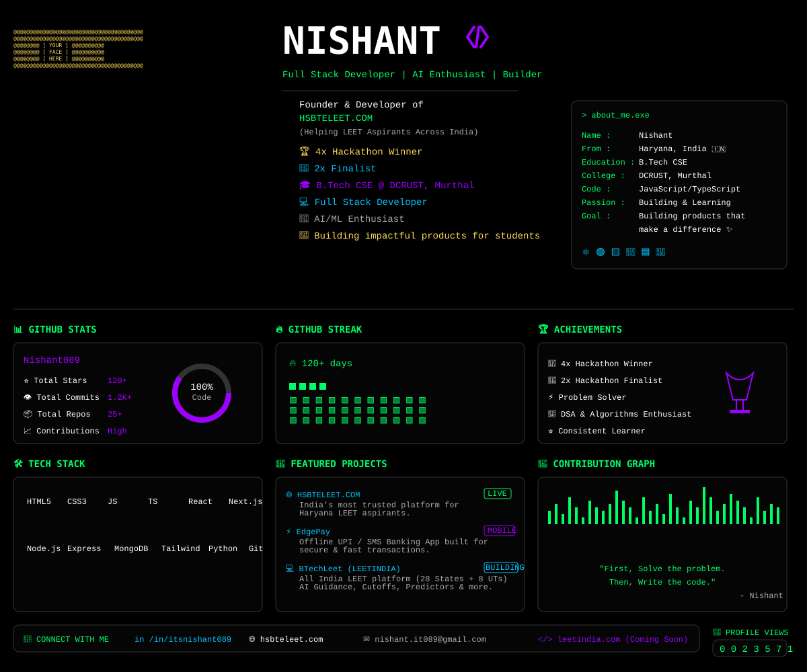

  

<!-- 
NOTE: 
To update your photo to the ASCII portrait shown in the screenshot:
1. Put a photo of yourself in the root directory (e.g., `my_photo.jpg`)
2. Run the script: `python scripts/image_to_ascii_svg.py my_photo.jpg ascii_portrait.svg`
3. Copy the `<g class="ascii">` code from `ascii_portrait.svg` and paste it into `svg/unified_layout.svg` at line 37, replacing the placeholder ASCII text.
-->
