<!-- 
  =============================================================================
  NISHANT'S GITHUB PROFILE README
  Theme: Dark Hacker + Matrix + Cyberpunk + Modern Glassmorphism
  Repository: itsnishant089/itsnishant089
  Author: Nishant
  Website: https://itsnishant.com
  =============================================================================
-->

<div align="center">

<!-- ==================== 1. HERO BANNER (ANIMATED SVG) ==================== -->
<a href="https://itsnishant.com">
  
</a>

<br/>
<br/>

<!-- ==================== 2. BADGES & HIGHLIGHTS ==================== -->
<!-- Portfolio Badge -->
<a href="https://itsnishant.com">
  
</a>
&nbsp;
<!-- Hacker Badge -->

&nbsp;
<!-- Hackathons -->

&nbsp;
<!-- Profile Views -->
<a href="https://github.com/itsnishant089">
  
</a>

<br/><br/>

<!-- ==================== 3. TERMINAL ASCII INTRO ==================== -->
```bash
$ nishant --whoami

    ███╗   ██╗██╗███████╗██╗  ██╗ █████╗ ███╗   ██╗████████╗
    ████╗  ██║██║██╔════╝██║  ██║██╔══██╗████╗  ██║╚══██╔══╝
    ██╔██╗ ██║██║███████╗███████║███████║██╔██╗ ██║   ██║   
    ██║╚██╗██║██║╚════██║██╔══██║██╔══██║██║╚██╗██║   ██║   
    ██║ ╚████║██║███████║██║  ██║██║  ██║██║ ╚████║   ██║   
    ╚═╝  ╚═══╝╚═╝╚══════╝╚═╝  ╚═╝╚═╝  ╚═╝╚═╝  ╚═══╝   ╚═╝   

> Full-Stack Developer | Problem Solver | Builder
> B.Tech CSE @ DCRUST Murthal (2025-2028)
> Diploma in Computer Eng. @ GPMA (80.85%)
```

<br/>

<!-- ==================== 4. TYPING SVG ==================== -->
<a href="https://itsnishant.com">
  
</a>

<br/>
<br/>
<br/>

</div>

<!-- ==================== 5. ABOUT ME ==================== -->
## 👨‍💻 `cat /home/nishant/about.md`

<table>
<tr>
<td width="60%">

Hello! I'm **Nishant**, a passionate and motivated Computer Engineering professional based in Hisar, Haryana. 
I specialize in building **high-performance, production-ready web applications** that solve real problems.

* 🎓 **Education:** Pursuing **B.Tech CSE** at DCRUST Murthal (2025-2028). Completed Diploma in Computer Engineering from GPMA with **80.85%**.
* 🏆 **Competitor:** **4x Hackathon Winner** and 3x Finalist, thriving in high-pressure environments.
* 🚀 **Builder:** Creator of **`hsbteleet.com`** (26.5K+ search clicks, 316K+ impressions, 250+ pages shipped) and **`btechleet.com`**.
* 💡 **Focus:** Full-stack development, beautiful UI/UX, database architecture, and AI integration.

</td>
<td width="40%" align="center">



</td>
</tr>
</table>

<br/>

<!-- ==================== 6. ACHIEVEMENTS & TIMELINE ==================== -->
## 🏆 `cat /var/log/achievements.log`

<div align="center">
  
</div>

<br/>

<!-- ==================== 7. EXPERIENCE ==================== -->
## 💼 `./execute_experience.sh`

<table width="100%">
<tr>
<th width="30%">Role</th>
<th width="40%">Organization / Project</th>
<th width="30%">Timeline</th>
</tr>

<tr>
<td><b>NSS Volunteer & Leader</b></td>
<td>National Service Scheme (NSS)</td>
<td><i>July 2023 – March 2025</i></td>
</tr>
<tr>
<td colspan="3">
- Led and managed <b>100+ volunteers</b> in social service activities.<br/>
- Organized <b>5+ camps</b>, awareness programs, and community events.<br/>
- Maintained volunteer data and reports using MS Excel.
</td>
</tr>

<tr>
<td><b>Full-Stack Developer</b></td>
<td>Freelance / Independent Builder</td>
<td><i>2023 – Present</i></td>
</tr>
<tr>
<td colspan="3">
- Shipped <b>hsbteleet.com</b> to production, scaling to 26.5K+ search clicks and 316K+ impressions.<br/>
- Built <b>btechleet.com</b>, mapping 28 states and 8 UTs for diploma-to-degree transitions.<br/>
- Developed <b>Roshni Creations</b>, a premium jewellery e-commerce platform with 3D product previews.
</td>
</tr>
</table>

<br/>

<!-- ==================== 8. EDUCATION ==================== -->
## 🎓 `cat /etc/education.conf`

<details open>
<summary><b>🎓 Bachelor of Technology (B.Tech) - Computer Science & Engineering</b></summary>
<br/>
<table width="100%">
<tr>
<td width="80%">
<b>Deenbandhu Chhotu Ram University of Science & Technology (DCRUST)</b><br/>
<i>Murthal, Haryana, India</i><br/>
Status: <b>Pursuing</b>
</td>
<td width="20%" align="right">
<b>Aug 2025 – Jun 2028</b>
</td>
</tr>
</table>
</details>

<details open>
<summary><b>📜 Diploma in Computer Engineering</b></summary>
<br/>
<table width="100%">
<tr>
<td width="80%">
<b>Govt. Polytechnic, Mandi Adampur (HSBTE)</b><br/>
<i>Hisar, Haryana, India</i><br/>
Score: <b>80.85%</b> | Status: <b>Completed</b>
</td>
<td width="20%" align="right">
<b>Aug 2022 – Jul 2025</b>
</td>
</tr>
</table>
</details>

<br/>

<!-- ==================== 9. FEATURED PROJECTS ==================== -->
## 🚀 `ls -la /var/www/projects`

### 🌟 [hsbteleet.com](https://hsbteleet.com)
> **LEET & HSBTE Exam Platform for Haryana Diploma Students**

* **Scale:** 26.5K+ Google Search Console clicks, 316K+ impressions, 250+ content pages.
* **Features:** Browser-based PYQ quiz engine (10 papers), AI chatbot support via Gemini API, referral flows, rank/college predictor tools, and a full admin portal.
* **Tech Stack:** HTML/CSS/JS, Supabase, Razorpay, Vercel, Gemini API, EmailJS.

### 🌐 [btechleet.com](https://btechleet.com)
> **All-India B.Tech Lateral Entry Platform**

* **Scope:** Mapping 28 states and 8 UTs, guiding diploma students across India.
* **Features:** Cutoff predictors, AI counseling help, PYQs, revision notes, and dashboard workspaces.
* **Tech Stack:** Next.js, Payload CMS, PostgreSQL, Prisma, Cloudflare R2/WAF, Redis, Resend, Razorpay.

### 💎 Roshni Creations
> **Fine Jewellery E-Commerce Platform**

* **Features:** Premium mobile-first navigation, Instagram-style product reels, live gold/silver pricing, interactive 3D product previews powered by Model Viewer.
* **Tech Stack:** React 18, Vite, Tailwind CSS, Firebase, Firestore, Razorpay, Framer Motion.

### 📡 EdgePay
> **Offline-first UPI Payment App for Rural India**

* **Hackathon:** 2nd Place at HACKRUST (DCRUST Murthal).
* **Concept:** Designed for areas with limited connectivity using USSD and GSM infrastructure.

<br/>

<!-- ==================== 10. TECHNICAL SKILLS ==================== -->
## 🛠️ `source ~/.skills`

<div align="center">
  
</div>

<br/>

**Languages:**


**Frontend:**


**Backend & Database:**


**Tools & Cloud:**


<br/>

<!-- ==================== 11. GITHUB STATS ==================== -->
## 📊 `htop --user=nishant`

<div align="center">

<table width="100%">
<tr>
<td width="50%" align="center">
  
</td>
<td width="50%" align="center">
  
</td>
</tr>
<tr>
<td colspan="2" align="center">
  
</td>
</tr>
</table>

</div>

<br/>

<!-- ==================== 12. CONTRIBUTION GRAPH ==================== -->
## 📈 `git log --graph --all`

<div align="center">
  
</div>

<br/>

<!-- ==================== 13. SNAKE ANIMATION ==================== -->
## 🐍 `python3 snake.py`

<div align="center">
  <picture>
    <source media="(prefers-color-scheme: dark)" srcset="https://raw.githubusercontent.com/itsnishant089/itsnishant089/output/dist/github-snake-dark.svg">
    <source media="(prefers-color-scheme: light)" srcset="https://raw.githubusercontent.com/itsnishant089/itsnishant089/output/dist/github-snake.svg">
    
  </picture>
</div>
*(Generated daily via GitHub Actions)*

<br/>

<!-- ==================== 14. SPOTIFY / NOW PLAYING ==================== -->
## 🎵 `spicetify status`

<div align="center">
<!-- 
  NOTE: To activate Spotify integration, you need to set up novatorem/spotify-github-profile
  or a similar service with your personal Spotify API keys.
  Uncomment the image below once configured.
-->
<a href="https://open.spotify.com/user/your_spotify_id">
  
</a>
</div>

<br/>

<!-- ==================== 15. DEV QUOTE ==================== -->
## 💬 `fortune | cowsay`

<div align="center">
  <a href="https://github.com/piyushsuthar/github-readme-quotes">
    
  </a>
</div>

<br/>

<!-- ==================== 16. SUPPORT & CONNECT ==================== -->
## 🤝 `ping -c 4 nishant.local`

<div align="center">

If you want to collaborate, hire, or talk through an idea, I'm easy to reach and happy to connect.

<br/>

<a href="https://itsnishant.com"></a>
&nbsp;
<a href="https://github.com/itsnishant089"></a>
&nbsp;
<a href="https://www.linkedin.com/in/nishant-4aa891346/"></a>
&nbsp;
<a href="mailto:contact@itsnishant.com"></a>

<br/><br/>

<a href="https://hsbteleet.com">
  
</a>

</div>

<br/>

<!-- ==================== 17. FOOTER ==================== -->

<div align="center">
  
</div>
